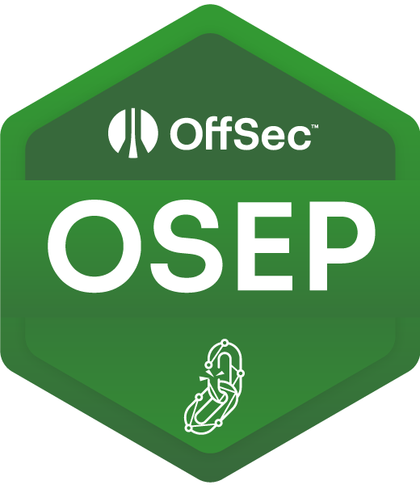
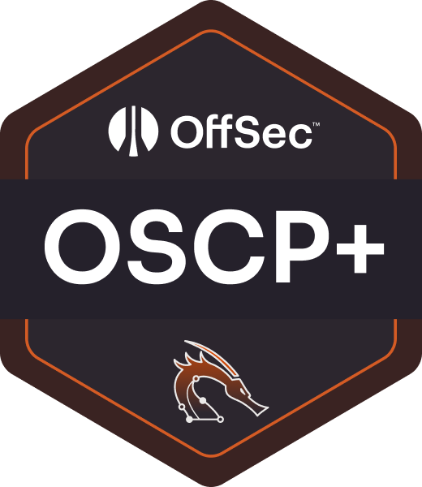
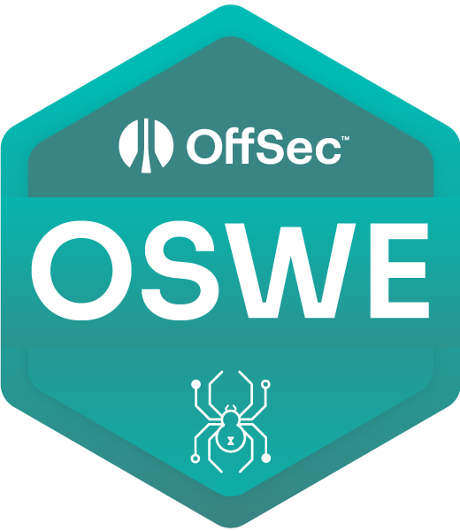
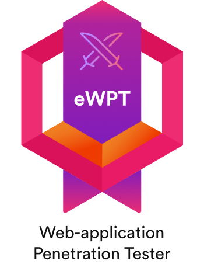
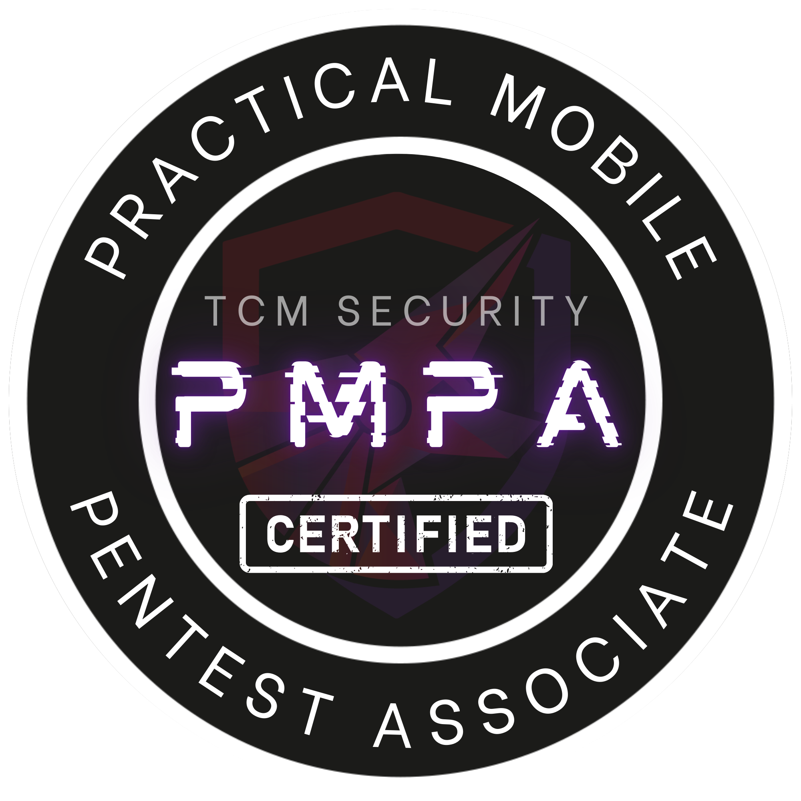
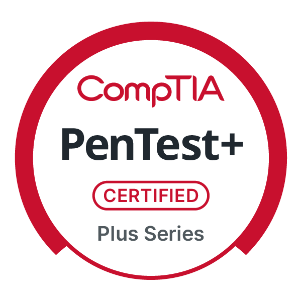
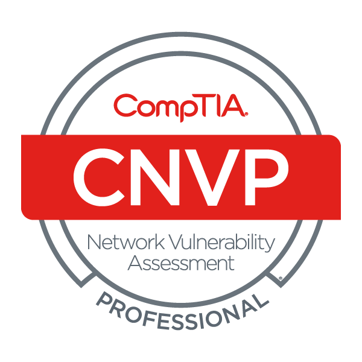

# Supakiad S. (m3ez)

**Supakiad S.** Offensive security specialist.

I break things professionally. The report is how you know it was authorized.

`General Bae` · `Web Security` · `Red Team` · `Security Researcher` · `Vulnerability Research`

## published CVEs

<!-- WORDFENCE-CVES:START -->
[**43 CVEs**](https://www.wordfence.com/threat-intel/vulnerabilities/researchers/supakiad-s) · newest first, because archaeology can wait.

[CVE-2026-18352](https://www.wordfence.com/threat-intel/vulnerabilities/id/4e88efe0-ffad-4d66-bb03-3f3a9dcbe5b1?source=api-prod) · [CVE-2026-15981](https://www.wordfence.com/threat-intel/vulnerabilities/id/b412f60f-61ea-47b1-a3ef-17275f7951df?source=api-prod) · [CVE-2026-1372](https://www.wordfence.com/threat-intel/vulnerabilities/id/8a276a3e-12c3-4af7-9eb8-a25d20563de7?source=api-prod) · [CVE-2026-15022](https://www.wordfence.com/threat-intel/vulnerabilities/id/8cd603aa-c4d4-488c-b134-6983240c3a18?source=api-prod) · [CVE-2026-7655](https://www.wordfence.com/threat-intel/vulnerabilities/id/e19f5f7b-6698-4275-a362-15e5441e0fa9?source=api-prod) · [CVE-2026-12761](https://www.wordfence.com/threat-intel/vulnerabilities/id/a56b59ce-29c2-4172-b703-a06d7bb28da0?source=api-prod) · [CVE-2026-1869](https://www.wordfence.com/threat-intel/vulnerabilities/id/9bf5b60b-5a4f-4227-97ac-a952019f46d9?source=api-prod) · [CVE-2026-4058](https://www.wordfence.com/threat-intel/vulnerabilities/id/ffdf34bb-a887-444c-8a76-12901fed6662?source=api-prod) · [CVE-2026-7634](https://www.wordfence.com/threat-intel/vulnerabilities/id/0a309bf8-7fe3-4033-993c-3c8dba0f216d?source=api-prod) · [CVE-2026-7651](https://www.wordfence.com/threat-intel/vulnerabilities/id/0def7637-edf4-4ae2-a2e7-31ccb3b52d71?source=api-prod) · [CVE-2026-4409](https://www.wordfence.com/threat-intel/vulnerabilities/id/91f9235e-f578-475f-92c3-34062d6d1e3d?source=api-prod) · [CVE-2026-2554](https://www.wordfence.com/threat-intel/vulnerabilities/id/21e397a4-0b32-4b13-a46b-c465acea0796?source=api-prod) · [CVE-2026-4949](https://www.wordfence.com/threat-intel/vulnerabilities/id/4cc29d32-2727-42df-bd42-2caf0f182c0e?source=api-prod) · [CVE-2026-4109](https://www.wordfence.com/threat-intel/vulnerabilities/id/87f82d5d-d89a-440d-8c23-ace5160a0739?source=api-prod) · [CVE-2026-4365](https://www.wordfence.com/threat-intel/vulnerabilities/id/021bd566-1663-46ba-a616-ab554b691cbb?source=api-prod) · [CVE-2026-3360](https://www.wordfence.com/threat-intel/vulnerabilities/id/7f365519-dd0a-4f39-880d-7216ce2f7d1e?source=api-prod) · [CVE-2026-2936](https://www.wordfence.com/threat-intel/vulnerabilities/id/bd8e86b0-5e06-44e0-a94c-b05581f46e5a?source=api-prod) · [CVE-2026-3445](https://www.wordfence.com/threat-intel/vulnerabilities/id/ae1e198b-0c0d-47aa-8a56-ec4e790c8022?source=api-prod) · [CVE-2026-2231](https://www.wordfence.com/threat-intel/vulnerabilities/id/37441cc0-c43c-40e4-a170-1be59e112272?source=api-prod) · [CVE-2026-4021](https://www.wordfence.com/threat-intel/vulnerabilities/id/f1b9725b-dee5-44ca-bb33-c6812fb76adc?source=api-prod) · [CVE-2026-32498](https://www.wordfence.com/threat-intel/vulnerabilities/id/f6515d70-438b-47b7-a3c4-5b8dc401a40e?source=api-prod) · [CVE-2026-4136](https://www.wordfence.com/threat-intel/vulnerabilities/id/e4cf42d3-9864-440b-8357-36c82cbef28f?source=api-prod) · [CVE-2026-1238](https://www.wordfence.com/threat-intel/vulnerabilities/id/e991fbdf-8e26-4d2e-8e3b-c8990914dcad?source=api-prod) · [CVE-2026-2233](https://www.wordfence.com/threat-intel/vulnerabilities/id/e0a278a3-f229-4673-8b3e-5b68f383dcc7?source=api-prod) · [CVE-2025-13673](https://www.wordfence.com/threat-intel/vulnerabilities/id/007df869-dacb-4b0a-9c98-50586934cdab?source=api-prod) · [CVE-2026-23799](https://www.wordfence.com/threat-intel/vulnerabilities/id/24009534-3a57-4ed3-b841-72e87e2a6925?source=api-prod) · [CVE-2025-12884](https://www.wordfence.com/threat-intel/vulnerabilities/id/a1ad32fb-929e-4181-8789-df50a77a71ef?source=api-prod) · [CVE-2026-32385](https://www.wordfence.com/threat-intel/vulnerabilities/id/63099a49-913f-428d-b9a4-85e1bc5afe56?source=api-prod) · [CVE-2026-1371](https://www.wordfence.com/threat-intel/vulnerabilities/id/7f5c5f64-a864-4ce1-9080-19f7c4418307?source=api-prod) · [CVE-2026-1058](https://www.wordfence.com/threat-intel/vulnerabilities/id/e0ec0027-2792-4069-b413-8fdd951f5fe7?source=api-prod) · [CVE-2026-1065](https://www.wordfence.com/threat-intel/vulnerabilities/id/8230d5f8-01d9-465a-8a43-e9852248bb3d?source=api-prod) · [CVE-2026-0683](https://www.wordfence.com/threat-intel/vulnerabilities/id/a7856d0f-bc7d-436c-968c-631fd6a686ab?source=api-prod) · [CVE-2025-12984](https://www.wordfence.com/threat-intel/vulnerabilities/id/729e8a06-abaa-4468-8a80-1e5c6cbace92?source=api-prod) · [CVE-2025-13628](https://www.wordfence.com/threat-intel/vulnerabilities/id/46f71f7b-7326-47b6-a23a-68a40f5bb56b?source=api-prod) · [CVE-2025-13935](https://www.wordfence.com/threat-intel/vulnerabilities/id/7b8b111a-9626-41f4-8a13-51f576af0257?source=api-prod) · [CVE-2025-13934](https://www.wordfence.com/threat-intel/vulnerabilities/id/5de212c9-5c2e-4713-b1ce-022dd84520c3?source=api-prod) · [CVE-2025-15057](https://www.wordfence.com/threat-intel/vulnerabilities/id/90920df9-1362-466b-b14b-4714087f556b?source=api-prod) · [CVE-2025-15055](https://www.wordfence.com/threat-intel/vulnerabilities/id/afbfabfc-b923-4fe9-9e8f-0cf159f488db?source=api-prod) · [CVE-2025-13679](https://www.wordfence.com/threat-intel/vulnerabilities/id/0830d0c3-99c0-423e-99ab-f0c1cbec52d9?source=api-prod) · [CVE-2025-13964](https://www.wordfence.com/threat-intel/vulnerabilities/id/ae363511-8a1f-476a-9851-61f7763428c2?source=api-prod) · [CVE-2025-47555](https://www.wordfence.com/threat-intel/vulnerabilities/id/5849a9f6-715e-4ac8-a0f7-1cd0814fff58?source=api-prod) · [CVE-2025-14151](https://www.wordfence.com/threat-intel/vulnerabilities/id/6ee675dd-5b43-439f-9717-6c531e9bf066?source=api-prod) · [CVE-2025-12814](https://www.wordfence.com/threat-intel/vulnerabilities/id/a376cafb-656c-4fe1-b5c1-c7e38dc5040e?source=api-prod)
<!-- WORDFENCE-CVES:END -->

**More credits** · [Patchstack](https://patchstack.com/database/researchers/d7a606d8-9d89-4bcf-a973-f8ebe721b82f): [CVE-2024-4367](https://patchstack.com/database/wordpress/plugin/3d-flipbook-dflip-lite/vulnerability/wordpress-pdf-flipbook-3d-flipbook-pdf-embed-pdf-viewer-plugin-2-2-55-cross-site-scripting-xss-vulnerability) · [GitHub Advisory Database](https://github.com/advisories?query=credit%3Am3ez): [CVE-2025-66307](https://github.com/advisories/GHSA-q3qx-cp62-f6m7)

## receipts

  
  
  
  

  
  
  
  
  
  
  
  
  
  
  

## references

[Portfolio](https://m3ez.github.io) · [Wordfence](https://www.wordfence.com/threat-intel/vulnerabilities/researchers/supakiad-s) · [Patchstack](https://patchstack.com/database/researchers/d7a606d8-9d89-4bcf-a973-f8ebe721b82f) · [GitHub Advisories](https://github.com/advisories?query=credit%3Am3ez) · [Accredible](https://www.credential.net/profile/supakiadsatuwan533944) · [Credly](https://www.credly.com/users/supakiad-satuwan) · [OffSec](https://credentials.offsec.com/1b595015-c060-4e65-9c75-2319d2f31554#acc.nx1uY5OR)
